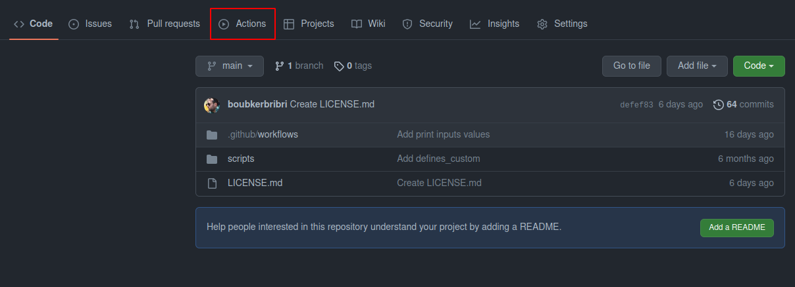
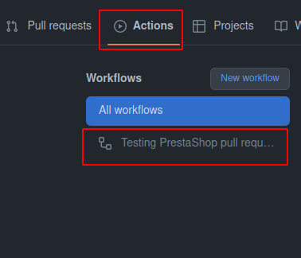
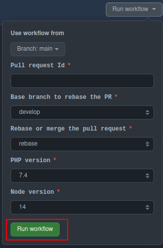
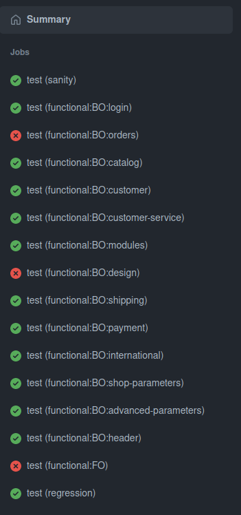
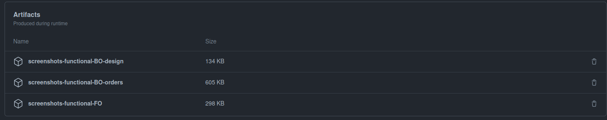

# Testing Pull Request

## Why use it ?
Sometimes, when creating a new pull request, running `Sanity tests` is not enough, So you need to run all existing tests on it.
This repository will help you do that.

⚠️ Don't forget to update your fork: this tool is regularly improved and you have to use the latest version of it. 

## How to use it ?
First of all, you have to fork this repository on GitHub, to have the same one linked to your user account.

After that, it's very simple : 
1. Click on **Actions Tab**

2. On Actions Tab, Click on the **workflow name** on the list

3. Once on  the workflow, Click on **Run Workflow**

4. Fill the form and submit the workflow

### How to fill the form ?

|      Parameter      |                          Description                          |                   Default                    |
|:-------------------:|:-------------------------------------------------------------:|:--------------------------------------------:|
|      `Branch`       |             The branch of `testing_pr` repository             |                    `main`                    |
|  `Pull request Id`  |   ID of Pull request on `PrestaShop/PrestaShop` repository    | No default value, you must fill it to submit |
|    `Base Branch`    |    Target Branch of you pull request (ex: 8.0.x, develop)     |                  `develop`                   |
|     `DEV Mode`      |               Enable/Disable the developer mode               |                   `false`                    |
|  `Rebase or merge`  | Git method to use to get the last updates for target branches |                   `rebase`                   |
|    `PHP version`    |      PHP version to use to setup PrestaShop environment       |                    `8.1`                     |
|   `Node Version`    |      Node version to use to setup PrestaShop environment      |                     `14`                     |
|     `Database`      |         Database engine on which PrestaShop will run          |                    `mysql`                   |

⚠️ You can test your pull request on mysql or mariadb, if you feel like the SQL engine could have a significant impact on the modifications you made, then you should run both.

### How to analyze results ?

When you submit your run, a new line workflow is launched, with parallel jobs.

You can enter each job to check which step is failing. And you can also download screenshots from summary view.

