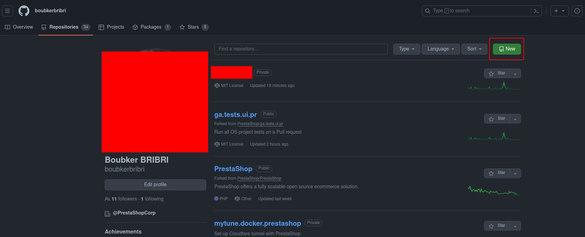
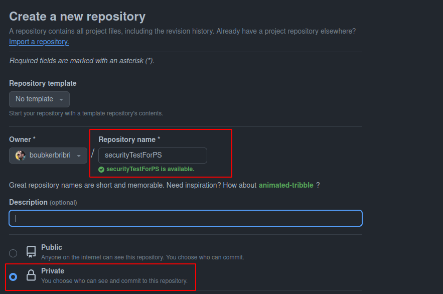
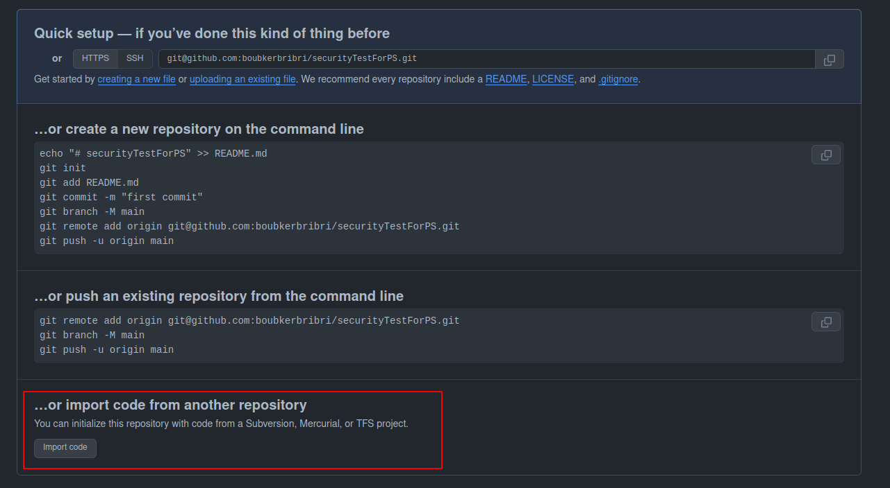
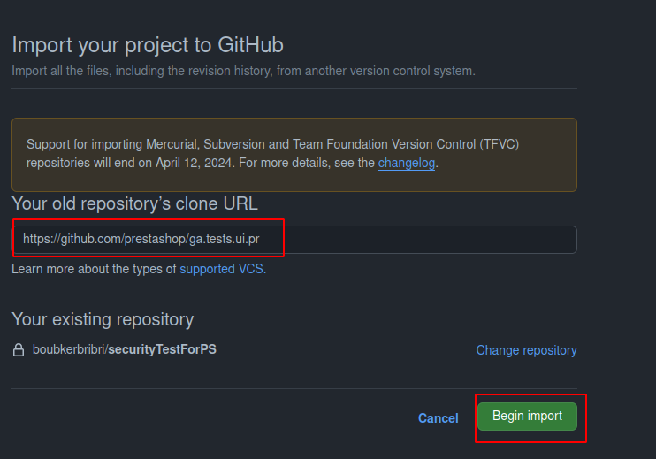
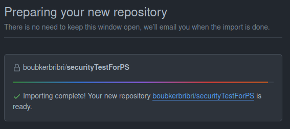
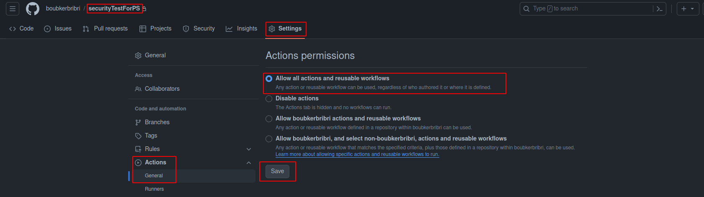
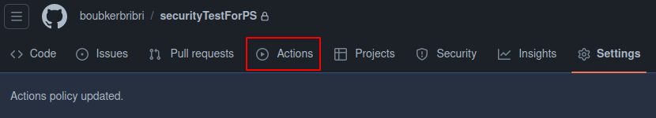
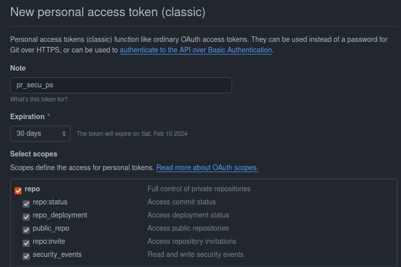
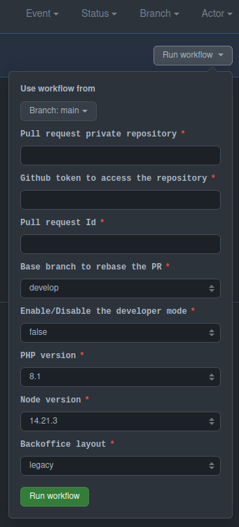

# How to test a security pull request

As we know, Security Pull requests are hidden on PrestaShop/PrestaShop repository, So it's hard to launch Automatic tests on it.
For this purpose, we did create a new workflow called [Testing Security PrestaShop pull requests (without cache)](./.github/workflows/pr_security_test_one.yml).

## Pre-requisites

### Create a private repository of `PrestaShop/ga.test.ui.pr`

Before you start testing you need to make sure that **NO ACCESS ARE GRANTED** on where you test, and since you can make a fork of public repository private (Github policy), you need to create a new private one, following these steps :

1. Go to your Profile -> Repositories then click on <kbd style="background-color: green">**New**</kbd>

2. Add a name and Make it **PRIVATE**

3. Then Create The Repository

4. Once created, click on <kbd style="background-color: #373e47">**Import Code**</kbd> below page

5. Add Link to [PrestaShop/ga.test.ui.pr](https://github.com/prestashop/ga.tests.ui.pr) and click on <kbd style="background-color: green">**Begin import**</kbd>

6. Congrats, your Repository is Ready.

### Activate Actions on the new Repository

When a new private Repository is created with Import, Actions are disabled, you should enable it, To do that, you have to :

1. Go To Your Repository -> Setting -> Actions General

2. Check `Allow all actions and reusable workflows`

3. Click on <kbd style="background-color: #373e47">**Save**</kbd>

4. Congrats, Actions are available now

### Create A personal Token

A token will serve to access the private repository of the pull request, you can refer to this [tutorial](https://docs.github.com/en/authentication/keeping-your-account-and-data-secure/managing-your-personal-access-tokens) to do so.
You need to only check this part on the setting

Copy Your token and **Keep it safe**

PS: You can set the expiration date to the minimum (7 days) so it can not be used a lot.

## Start Your Test

Congratulations 🎉, You can now test the security pull request.

## How to use it ?

You can use the private repository you created following these steps :

1. Click on **Actions Tab**

2. On Actions Tab, Click on the **workflow name** on the list `Testing Security PrestaShop pull requests`

3. Once on  the workflow, Click on **Run Workflow**

4. Fill the form and submit the workflow

### How to fill the form ?

|             Parameter             |                                Description                                 |                   Default                    |
|:---------------------------------:|:--------------------------------------------------------------------------:|:--------------------------------------------:|
| `Pull request private repository` |      The Name of the fork to use (ex `PrestaShop/PrestaShop-abc-xyz`)      | No default value, you must fill it to submit |
|          `Github token`           | The Token will serve to access the repository (created and copied earlier) | No default value, you must fill it to submit |
|         `Pull request Id`         |      ID of Pull request on `PrestaShop/PrestaShop-abc-xyz` repository      | No default value, you must fill it to submit |
|           `Base Branch`           |           Target Branch of you pull request (ex: 8.0.x, develop)           |                  `develop`                   |
|            `DEV Mode`             |                     Enable/Disable the developer mode                      |                   `false`                    |
|           `PHP version`           |             PHP version to use to setup PrestaShop environment             |                    `8.1`                     |
|          `Node Version`           |            Node version to use to setup PrestaShop environment             |                     `14`                     |
|        `Backoffice layout`        |                           `Legacy` or `Symfony`                            |                   `Legacy`                   |

## Cleaning up behind

After finishing the tests, when you finally validate the pull request(s), you should clean behind by:

- [Deleting the private repository you created](https://docs.github.com/en/repositories/creating-and-managing-repositories/deleting-a-repository)
- [Deleting the access Token you created](https://docs.github.com/en/enterprise-server@3.8/authentication/keeping-your-account-and-data-secure/managing-your-personal-access-tokens#deleting-a-personal-access-token)
