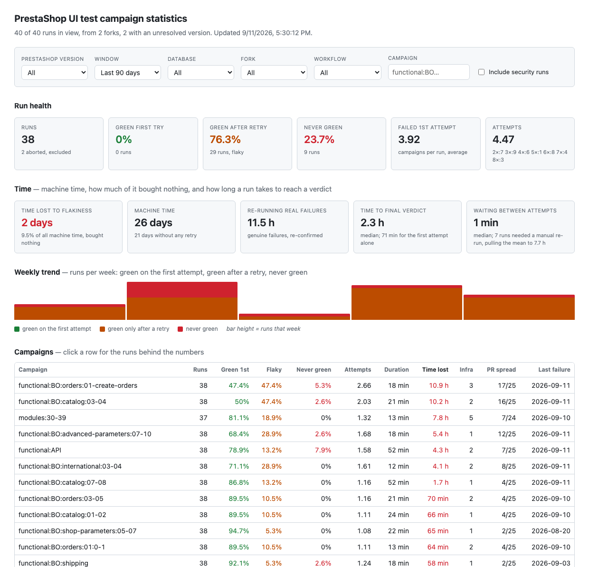
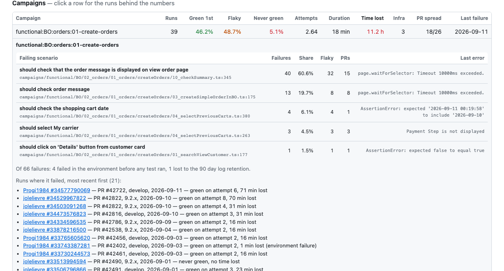

# UI test campaign statistics

Finds the flaky campaigns: which ones fail, how often a retry rescues them, and across how
many unrelated pull requests. Covers every fork, not just runs started by the core team.

Nothing is added to the test workflows. Everything is read back from the GitHub API after
the fact, which is the only approach that can see contributor forks at all: a fork's
`GITHUB_TOKEN` is scoped to the fork and forks get no secrets, so a fork job could never
push results to a central store. GitHub's own Actions metrics and third-party flaky-test
services have the same blind spot, since they only see repositories inside the organisation.

Code lives on the default branch. Data and the dashboard live on the orphan `stats` branch,
so the forks of this repository carry none of it.

## What it looks like



Clicking a campaign shows which scenarios are behind its failures, with the spec file from
the core repository and the share of that campaign's failures each one accounts for:



Screenshots are regenerated with `docs/take-screenshots.mjs`.

## The one thing to know before touching this code

The GitHub API reports the same campaign several times when a run has been retried. When
`gh run rerun --failed` creates attempt N, every job of the run is re-listed under attempt
N, including the ones that were not re-run. Those carried-over rows get a **new job id** and
a **relabelled `run_attempt`**, and keep their **original timestamps**.

On run `jolelievre/ga.tests.ui.pr#34473576823` (3 attempts) the API returns **138 rows for
51 real jobs**, 50 of which are campaign executions and one the prep job. Counting rows
would report 5 failures out of 138 (3.6%) instead of 5 out of 50 (10.0%), and would count a
campaign that passed once as having passed three times.

An execution is therefore identified by `(job name, started_at)`, and its true attempt is
the **lowest** `run_attempt` among the rows sharing that key. `executions.test.js` pins this
down against a recorded copy of that run; keep it passing.

## Layout

| File | Role |
|---|---|
| `github.js` | REST client: runs, jobs, logs (byte ranges), pull requests. Retries transient failures, stops at a rate-limit floor |
| `executions.js` | Job rows → real campaign executions. The dedupe rule above, campaign names, test vs infra failures |
| `parse-log.js` | Job log → dispatch inputs, resolved PrestaShop version, failing test |
| `branch-key.js` | A pull request's target branch → version line (`develop`, `9.2.x`, …) |
| `collect.js` | One invocation: list every repository, diff against the index, store what is new |
| `metrics.js` | The statistics. Imported by the aggregator **and** by the dashboard, so the page and the generated summary cannot disagree |
| `dataset.js` | Packs run files into one small file the browser downloads whole; CSV export (on demand, `--csv`) |
| `aggregate.js` | Run files → `site/` |
| `store.js` | One JSON file per run, plus the index of what has been processed |
| `cache.js` | Record and replay of API responses |
| `site/` | The dashboard: `index.html` + `app.js` |

## Why there is no watermark

Each invocation lists **every** run of **every** repository and diffs it against
`data/index.json`. Re-enumerating the whole population costs about 127 requests out of the
5000 per hour, which is cheap enough to make the obvious optimisation not worth its bugs.

A watermark ("page until the newest run already known") would permanently skip any run that
was still in progress when it was first seen, since the list is ordered by `created_at` and
nothing ever moves it back to the top. It would also never notice a retry of an older run,
because re-running does not change `created_at`. Paginating a list that is being appended to
can drop an entry at a page boundary too.

A run enters the work queue when its id is unknown, its attempt count has grown, or it has
finished since it was last seen. `--max-runs` caps how many are *processed*, never how many
are listed, so a long backlog drains over several invocations with no cursor to maintain.

## Resolving the PrestaShop version

Tried in this order, and the source is recorded on each run as `branch_key_source`:

1. **`resolved-log`** — the `Resolved from PR / detected PrestaShop version:` block in a job
   log, read from a 64 KB head range rather than the whole ~274 KB log.
2. **`pr-lookup`** — the pull request's target branch, using the `PR_NUMBER` found in the
   log's inputs block. Works for closed pull requests, and is cached by PR number.
3. **`job-name`** — an older generation put the branch in the job name
   (`test (audit, develop)`). Last resort, used when the log has expired.

The order is deliberately not cheapest-first. Only `base_branch (PR target)` means the same
thing in every generation: one older workflow printed `branch_key (matrix key): develop` on
a run whose pull request targeted 9.2.x, and named its jobs to match, so trusting either
would file those runs under the wrong version.

Runs whose version cannot be resolved are kept with `branch_key: "unknown"` and shown as
their own bucket, never quietly merged into another version.

## Time lost

Reserved for flakiness. For a campaign that went red then green, everything it spent beyond
the single successful execution it should have needed is time that bought nothing.

A campaign that genuinely fails has lost nothing: that failure is the answer the run existed
to produce. It contributes zero. Re-running it afterwards to re-confirm the same failure is
still machine time, so it is reported on its own as `hardRetryMinutes` rather than inflating
the headline.

Three different clocks, all reported:

| | |
|---|---|
| `computeMinutes` | machine time actually spent, summed over every job |
| `firstAttemptMinutes` | what the same runs would have cost had nothing been retried |
| `lostMinutes` | the part of `computeMinutes` that flakiness wasted, with `lostPct` |
| `medianVerdictMinutes` | elapsed time to a final verdict, first job starting to last job ending. Campaigns run in parallel, so this is far below the machine time |
| `medianRunningMinutes` / `medianWaitingMinutes` | that elapsed time split into work and waiting between attempts |

### Why elapsed time is a median

Because the mean is meaningless here. Measured over 38 real runs:

| | median | mean |
|---|---|---|
| time to a final verdict | 139 min | 613 min |
| waiting between attempts | 1 min | 463 min |

`auto_retry_failed_jobs.yml` re-runs failed jobs the moment a run finishes, so consecutive
attempts are about 18 seconds apart. Of 132 measured gaps, the median is 0 and only 6 exceed
an hour.

Every one of those long gaps is the *last* gap of a run with 7 or 8 attempts. The automation
stops at `run_attempt < 6`, so past that somebody has to press re-run by hand, which happened
up to 5.6 days later. Seven of the 38 runs went that way, and they drag the mean to four
times anything a person actually experiences. `beyondRetryCap` counts them, so the effect
stays visible rather than hidden inside an average.

Per campaign, `medianDurationMin` is measured on successful executions only: `--bail` cuts a
failing campaign short, so its failures are not representative of what it costs to run.

## What is excluded, and why

- **Runs whose shop prebuild failed** are marked `aborted`: their campaigns never ran, so
  recording them would invent ~45 phantom failures per run.
- **Infra failures** (a step before the test step failed: docker, database, setup) are
  counted separately from test failures. A high infra rate calls for a different fix.
- **Cancelled and skipped** executions do not count towards pass or fail rates.
- **Security workflow runs** count towards campaign statistics, but their pull request
  number and inputs are not stored and their logs are not read.

## Which scenario failed

The collector reads the log of every job whose test step failed and keeps, for each failing
scenario, the suite, the title, the assertion message and the spec file with its line, for
example `campaigns/functional/API/02_checkEndpoints.ts:553`.

`--bail` usually stops a campaign at its first failing scenario, but the flag is not always
on, so every failure block is read rather than just the first.

The stack frame matters. A timeout inside a page object reports the helper first
(`tests/UI/node_modules/@prestashop-core/ui-testing/dist/pages/commonPage.js:8`), which names
no scenario and is the same file for every such failure; the first frame under `campaigns/`
is the spec somebody would actually open, so it wins whenever the stack has one.

Parsing anchors on the `N failing` summary, and stops after exactly that many blocks. The
spec reporter prints `1) <title>` inline where the test ran, long before the report at the
end, and without the anchor that line matches first and yields a heading with no suite. The
log does not stop at the report either: a hundred lines of teardown, artifact upload and
`##[endgroup]` markers follow it, and anything down there shaped like `1) restart mysql
container` would otherwise be read as another failure and named after the line beneath it.

The share reported against a scenario is a share of that campaign's failing **executions**,
which is what says where to start: a campaign that is red half the time because of a single
scenario is a very different job from one that is red for a dozen reasons.

Those are two different units, and the difference is only visible when `--bail` is off. A
scenario's *failures* column counts the times it was named; its *share* credits it `1/n` of
an execution that blamed n scenarios at once. Counting each of them as a whole failure
against a denominator of executions is what made one campaign report 175% of its own
failures. So the columns can legitimately total more than the campaign's failure count while
the shares never exceed 100%.

The whole log is fetched rather than a tail slice. The mocha report sits at the very end and
the log store does not honour suffix ranges, so a tail would cost one request to learn the
size and another to fetch it; the whole log is one request for about seven times the bytes,
and the rate limit is the scarce resource here, not bandwidth.

Failures whose log has expired are counted as `unattributed` rather than dropped, so the
shares visibly stop adding up to 100% instead of silently misleading. What the shares fall
short by is exactly the infra plus expired-log remainder the caveat line under the table
reports.

## Retention

Run and job metadata outlive logs by a long way. A run from five months ago still returns
its jobs, while its logs are already `410 Gone`. Logs and artifacts last 90 days. So
campaign-level history reaches back as far as GitHub keeps runs (about 14 months here),
while anything that needs a log is limited to the last 90 days.

## Running it locally

This is also how the dashboard is developed and how screenshots are produced.

```bash
export GITHUB_TOKEN=$(gh auth token)      # a normal user token is enough

# Pull a couple of forks into a local directory (no commit, no stats branch involved)
node tools/stats/run.mjs \
  --repo jolelievre/ga.tests.ui.pr \
  --repo Progi1984/ga.tests.ui.pr \
  --max-runs 40 --data-dir .local/data --out .local/site --record .local/fixtures

# Look at the result. Opening index.html from the filesystem does not work: the page fetches
# its data and imports ES modules, and browsers refuse both over file://
node tools/stats/serve.mjs .local/site     # http://localhost:4173, loopback only
```

The flat one-row-per-execution CSV is not part of the published site, because it is a
full-history rebuild that would be re-committed daily for something the page never reads.
Ask for it when you want it:

```bash
node tools/stats/run.mjs --aggregate-only --data-dir .local/data --out .local/site \
  --csv .local/executions.csv
```

`--record` saves every API response; `--replay <dir>` serves them back, so the dashboard and
the statistics can be iterated on with no token, no network and no rate limit:

```bash
node tools/stats/run.mjs --repo jolelievre/ga.tests.ui.pr \
  --replay .local/fixtures --data-dir .local/data --out .local/site

# Rebuild the site from data already pulled, without calling GitHub at all
node tools/stats/run.mjs --aggregate-only --data-dir .local/data --out .local/site
```

Run `node tools/stats/run.mjs --help` for every option, and `node --test` in this directory
for the test suite.

## In CI

`.github/workflows/stats.yml` runs daily, and on demand with a `max_runs` cap for draining
the backlog. It is inert on forks. It reads with `secrets.STATS_GH_TOKEN` (a fine-grained
token with read-only Actions access on public repositories) and pushes the data with the job
token. Without that secret it falls back to the job token, which is scoped to this repository
and cannot list a fork's runs at all; the job then annotates itself with a warning rather
than quietly collecting upstream-only data.

Partial failures are annotated too: repositories that could not be listed, runs that failed
to process, and job names that matched no known shape, which is how a workflow rename shows
up as a number rather than as a plausible spike in aborted runs. The job only goes red when
nothing at all could be collected, so a partial collection still commits the progress it made.

GitHub Pages should be pointed at the `stats` branch, `/site` folder.
